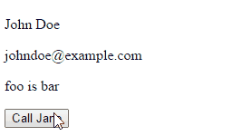
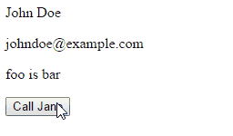

I've started working with reactjs and [using it with backbone](http://vkbansal.me/blog/using-react-with-backbone). I was really enjoying working with it, until, I hit a road block with `setState` method. The [documentation](http://facebook.github.io/react/docs/component-api.html#setstate) (at the time of writing v0.12.2) stated the following:

> Merges nextState with the current state. This is the primary method you use to trigger UI updates from event handlers and server request callbacks. In addition, you can supply an optional callback function that is executed once `setState` is completed and the component is re-rendered.

## The problem

The line `Merges nextState with the current state` lead me in thinking that it will merge the `nextState` completely or recursively. Lets see that as an example:

```jsx
var SomeComponent = React.createClass({
	getInitialState: function () {
		return {
			user: {
				name: 'John Doe',
				email: 'johndoe@example.com',
			},
			foo: 'bar',
		};
	},
	callJane: function () {
		this.setState({ user: { name: 'Jane Doe' } });
	},
	render: function () {
		return (
			<div>
				<p>{this.state.user.name}</p>
				<p>{this.state.user.email}</p>
				<p>foo is {this.state.foo}</p>
				<button onClick={this.callJane}>Call Jane</button>
			</div>
		);
	},
});

React.render(<SomeComponent />, document.getElementsByTagName('body')[0]);
```

When I click `Call Jane`, I expected just the name to be updated. But as you can see below, the email also vanished.



Upon inspection, I found out that the `setState` merges states only upto single level. So the following `InitialState`

```js
{
    user: {
        name: "John Doe",
        email: "johndoe@example.com"
    },
    foo : "bar"
}
```

was expected to be

```js
{
    user: {
        name: "Jane Doe",
        email: "johndoe@example.com"
    },
    foo : "bar"
}
```

But It turned out to be:

```js
{
    user: {
        name: "Jane Doe"
    },
    foo : "bar"
}
```

## The solution

I looked into utility libraries like underscore, lodash, etc.. Lodash has a `merge` method and jQuery has `$.extend` method that merge objects recursively. So I put together a quick mixin for recursive set state.

```js
//Using jQuery.extend
var setStateRecursiveMixin = {
	setStateRecursive: function (nextState) {
		var prevState = this.state;
		this.setState($.extend(true, {}, prevState, nextState));
	},
};

//Using Lodash.merge
var setStateRecursiveMixin = {
	setStateRecursive: function (nextState) {
		var prevState = this.state;
		this.setState(_.merge(prevState, nextState));
	},
};
```

It can be used as follows

```jsx
var SomeComponent = React.createClass({
	mixins: [setStateRecursiveMixin],
	getInitialState: function () {
		return {
			user: {
				name: 'John Doe',
				email: 'johndoe@example.com',
			},
			foo: 'bar',
		};
	},
	callJane: function () {
		this.setStateRecursive({ user: { name: 'Jane Doe' } });
	},
	render: function () {
		return (
			<div>
				<p>{this.state.user.name}</p>
				<p>{this.state.user.email}</p>
				<p>foo is {this.state.foo}</p>
				<button onClick={this.callJane}>Call Jane</button>
			</div>
		);
	},
});

React.render(<SomeComponent />, document.getElementsByTagName('body')[0]);
```

See the mixin in action below:


