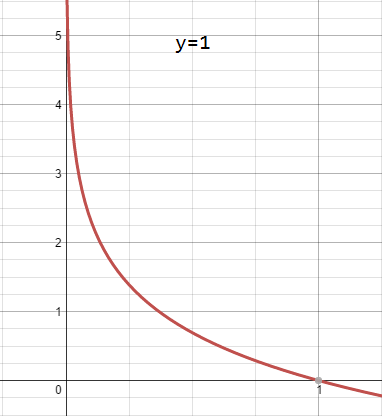
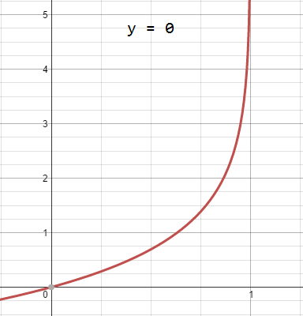

Instead of our output vector $\vec{y}$ being a continuous range of values, it will only be $0$ or $1$.

$$
y \in \{ 0, 1 \}
$$

Where $0$ is usually taken as the **negative class** and $1$ as the **positive class**, but you are free to assign any representation to it.

We're only doing two classes for now, called a _Binary Classification Problem_.

One method is to use linear regression and map all predictions greater than $0.5$ as a $1$ and all less than $0.5$ as a $0$. This method doesn't work well because classification is not actually a linear function.

## Hypothesis Representation

Our hypothesis should satisfy:

$$
0 \leq h_\theta(x) \leq 1
$$

Our new form uses the **Sigmoid Function**, also called the **Logistic Function**:

$$
\begin{align}
h_\theta (x) & = g (\theta^Tx) \\ \\
z & = \theta^T x \\ \\
g(z) &= \frac{1}{1 + e^{-z}}
\end{align}
$$


<!--{.img-center}-->

The function $g(z)$, shown here, maps any real number to the $(0, 1)$ interval, making it useful for transforming an arbitrary-valued function into a function better suited for classification.

We start with our old hypothesis (linear regression), except that we want to restrict the range to 0 and 1. This is accomplished by plugging $θ^Tx$ into the Logistic Function.

$h_\theta$ will give us the **probability** that our output is $1$. For example, $h_\theta(x)=0.7$ gives us the probability of $70\%$ that our output is $1$.

$$
\begin{alignat}{0}
h_\theta(x) = P(y=1|x; \theta) = 1 - P(y=0|x; \theta) \\ \\
P(y=1|x; \theta) + P(y=0|x; \theta) = 1
\end{alignat}
$$

Our probability that our prediction is $0$ is just the complement of our probability that it is $1$ (e.g. if probability that it is $1$ is $70\%$, then the probability that it is $0$ is $30\%$).

## Decision Boundary

In order to get our discrete $0$ or $1$ classification, we can translate the output of the hypothesis function as follows:

$$
h_\theta \geq 0.5 \longrightarrow y = 1 \\
h_\theta < 0.5 \longrightarrow y = 0
$$

The way our logistic function $g$ behaves is that when its input is greater than or equal to zero, its output is greater than or equal to $0.5$:

$$
g(z) \geq 0.5 \text{ when } z \geq 0
$$

Remember:

$$
z=0, e^0 =1, g(z) = 1/2 \\
z \rightarrow \infty, e^{-\infty} \rightarrow 0, g (z) = 0 \\
z \rightarrow -\infty, e^{\infty} \rightarrow \infty, g (z) = 1
$$

So if our input to $g$ is $θ^Tx$, then that means:

$$
h_\theta(x) = g(\theta^T x) \geq 0.5 \\ \text{ when } \theta^Tx \geq 0
$$

From these statements we can now say:

$$
\theta^T x \geq 0 \rightarrow y = 1 \\
\theta^T x < 0 \rightarrow y = 0
$$

The **decision boundary** is the line that separates the area where $y=0$ and where $y=1$. It is created by our hypothesis function.

**Example**:

$$
\begin{alignat}{0}
\theta =
\begin{bmatrix}
5 \\
-1 \\
0
\end{bmatrix} \\ \\
y = 1 \text{ if } 5 + (-1)x_1 + 0x_2 \geq 0 \\ \\
5 -x_1 \geq 0 \\ \\
x_1 \leq 5
\end{alignat}
$$

Our decision boundary then is a straight vertical line placed on the graph where $x_1=5$, and everything to the left of that denotes $y=1$, while everything to the right denotes $y=0$.

Again, the input to the sigmoid function $g(z)$ (e.g. $θ^T$x) need not be linear, and could be a function that describes a circle (e.g. $z=_0\theta+\theta_1 x_1^2 + \theta_2 x_2^2$) or any shape to fit our data.

## Cost Function

We cannot use the same cost function that we use for linear regression because the Logistic Function will cause the output to be wavy, causing many local optima. In other words, it will not be a convex function.

Instead, our cost function for logistic regression looks like:

$$
\begin{alignat}{0}
J(\theta) = \frac{1}{m} \sum_{i-1}^m Cost\left(h_\theta(x^{(i)}), y^{(i)}\right) \\ \\
Cost\left(h_\theta(x), y\right) =  -log(h_\theta(x)) &\text{ if } y = 1 \\ \\
Cost\left(h_\theta(x), y\right) =  -log(1 -h_\theta(x)) &\text{ if } y = 0 \\
\end{alignat}
$$

**Cost function for $y=1$:**



<!--{.img-center}-->

**Cost function for $y=0$:**



<!--{.img-center}-->

The more our hypothesis is off from $y$, the larger the cost function output. If our hypothesis is equal to $y$, then our cost is $0$:

$$
\begin{alignat}{0}
Cost\left(h_\theta(x), y\right) = 0 &\text{ if } h_\theta(x) = y \\
Cost\left(h_\theta(x), y\right) \rightarrow \infty &\text{ if } y = 0 \text{ and } h_\theta(x) \rightarrow 1 \\
Cost\left(h_\theta(x), y\right) \rightarrow \infty &\text{ if } y = 1 \text{ and } h_\theta(x) \rightarrow 0 \\
\end{alignat}
$$

If our correct answer $y$ is $0$, then the cost function will be $0$, if our hypothesis function also outputs $0$. If our hypothesis approaches $1$, then the cost function will approach $infinity$.

If our correct answer $y$ is $1$, then the cost function will be $0$, if our hypothesis function outputs $1$. If our hypothesis approaches $0$, then the cost function will approach $infinity$.

Note that writing the cost function in this way guarantees that $J(\theta)$ is convex for logistic regression.

## Simplified Cost Function and Gradient Descent

We can compress our cost function's two conditional cases into one case:

$$
Cost\left(h_\theta(x), y\right) = -y \space log\left(h_\theta(x)\right) - (1-y) \space log\left(1-h_\theta(x)\right)
$$

Notice that when $y$ is equal to $1$, then the second term ($(1−y) \space log\left(1−h_\theta(x)\right)$) will be zero and will not affect the result. If $y$ is equal to $0$, then the first term ($−y \space log\left(h_\theta(x)\right)$) will be zero and will not affect the result.

We can fully write out our entire cost function as follows:

$$
J(\theta) = -\frac{1}{m}  \sum_{i=1}^m[y^{(i)} \space log\left(h_\theta(x^{(i)})\right) + (1 - y^{(i)}) \space log\left(1-h_\theta(x^{(i)})\right)]
$$

A vectorized implementation is:

$$
J(\theta) = -\frac{1}{m}\left( log(g(X\theta))^T y + log(1-g(X\theta)^T (1-y))\right)
$$

### Gradient Descent

Remember that the general form of gradient descent is:

$$
\begin{align*}
& \text{Repeat : } \lbrace\\
& \hspace{2em} \theta_j := \theta_j - \alpha \frac{\partial}{\partial \theta_j}  J(\theta)\\
& \rbrace
\end{align*}
$$

We can work out the derivative part using calculus to get:

$$
\begin{align*}
& \text{Repeat : } \lbrace \\
& \hspace{2em} \theta_j := \theta_j  - \frac{\alpha}{m} \sum_{i=1}^{m} \left(h_\theta(x^{(i)} ) - y^{(i)}\right) x_j^{(i)}\\
& \rbrace
\end{align*}
$$

Notice that this algorithm is identical to the one we used in linear regression. We still have to simultaneously update all values in theta.

A vectorized implementation is:

$$
\theta := \theta - \frac{\alpha}{m} X^T\left(g(X\theta) - \vec{y}\right)
$$

### Partial derivative of J(θ)

First calculate derivative of sigmoid function (it will be useful while finding partial derivative of $J(\theta)$):

$$
\begin{align}
\sigma(x)' &= (\frac{1}{1 + e^{-x}})'
=  \frac{-(1+e^{-x})'}{(1 + e^{-x})^2}
= \frac{-(-e^{-x})}{(1 + e^{-x})^2} \\ \\
& = \frac{e^{-x}}{(1 + e^{-x})^2}
= (\frac{1}{1 + e^{-x}})(\frac{e^{-x}}{1 + e^{-x}}) \\ \\
&= \sigma(x) (\frac{1-1+e^{-x}}{1 + e^{-x}})
= \sigma(x) (\frac{1+e^{-x}}{1 + e^{-x}} - \frac{1}{1 + e^{-x}}) \\\\
&= \sigma(x)(1 - \sigma(x))
\end{align}
$$

Now we are ready to find out resulting partial derivative:

$$
\begin{align}
\frac{\partial}{\partial \theta_j} J(\theta)
&= \frac{\partial}{\partial \theta_j} \frac{-1}{m} \sum_{i=i}^m \space \left[y^{(i) } \space log(h_\theta(x^{(i)})) + (1-y^{(i)})log(1-h_\theta(x^{(i)}))\right] \\
&=  - \frac{1}{m}  \sum_{i=i}^m \space \left[y^{(i)}  \frac{\partial}{\partial \theta_j} log(h_\theta(x^{(i)})) + (1-y^{(i)})  \frac{\partial}{\partial \theta_j}log(1-h_\theta(x^{(i)}))\right] \\
&= - \frac{1}{m}  \sum_{i=i}^m \space \left[ \frac{y^{(i) } \frac{\partial}{\partial \theta_j} h_\theta(x^{(i)})}{h_\theta(x^{(i)})} + \frac{(1-y^{(i)}) \frac{\partial}{\partial \theta_j}  (1-h_\theta(x^{(i)}))}{1-h_\theta(x^{(i)})} \right] \\
&= - \frac{1}{m}  \sum_{i=i}^m \space \left[ \frac{y^{(i) } \frac{\partial}{\partial \theta_j} h_\theta(x^{(i)})}{h_\theta(x^{(i)})} + \frac{(1-y^{(i)}) \frac{\partial}{\partial \theta_j}  (1-h_\theta(x^{(i)}))}{1-h_\theta(x^{(i)})} \right] \\
&= - \frac{1}{m}  \sum_{i=i}^m \space \left[ \frac{y^{(i) } \frac{\partial}{\partial \theta_j} \sigma(\theta^T x^{(i)})}{h_\theta(x^{(i)})} + \frac{(1-y^{(i)}) \frac{\partial}{\partial \theta_j}  (1-\sigma(\theta^T x^{(i)}))}{1-h_\theta(x^{(i)})} \right] \\
&= - \frac{1}{m}  \sum_{i=i}^m \space \left[ \frac{y^{(i) } \sigma(\theta^T x^{(i)}) (1-\sigma(\theta^T x^{(i)})) \frac{\partial}{\partial \theta_j} \theta^T x^{(i)}}{h_\theta(x^{(i)})} + \frac{-(1-y^{(i)}) \sigma(\theta^T x^{(i)}) (1-\sigma(\theta^T x^{(i)})) \frac{\partial}{\partial \theta_j} \theta^T x^{(i)}}{1-h_\theta(x^{(i)})} \right] \\
&= - \frac{1}{m}  \sum_{i=i}^m \space \left[ \frac{y^{(i) } h_\theta(x^{(i)}) (1-h_\theta(x^{(i)})) \frac{\partial}{\partial \theta_j} \theta^T x^{(i)}}{h_\theta(x^{(i)})} - \frac{(1-y^{(i)}) h_\theta(x^{(i)}) (1 - h_\theta(x^{(i)})) \frac{\partial}{\partial \theta_j} \theta^T x^{(i)}}{1-h_\theta(x^{(i)})} \right] \\
&= - \frac{1}{m}  \sum_{i=i}^m \space \left[y^{(i)} (1-h_\theta(x^{(i)})) x_j - (1-y^{(i)}) h_\theta(x^{(i)}) x_j \right] \\
 & = - \frac{1}{m}  \sum_{i=i}^m \space \left[y^{(i)} (1-h_\theta(x^{(i)})) - (1-y^{(i)}) h_\theta(x^{(i)}) \right]  x_j\\
 & = - \frac{1}{m}  \sum_{i=i}^m \space \left[y^{(i)} -y^{(i)} h_\theta(x^{(i)}) - h_\theta(x^{(i)}) + y^{(i)} h_\theta(x^{(i)}) \right]  x_j\\
& = - \frac{1}{m}  \sum_{i=i}^m \space \left[y^{(i)} - h_\theta(x^{(i)}) \right]  x_j\\
& = \frac{1}{m}  \sum_{i=i}^m \space \left[h_\theta(x^{(i)}) - y^{(i)} \right]  x_j\\
\end{align}
$$

## Advanced Optimization

**Conjugate gradient**, **BFGS**, and **L-BFGS** are more sophisticated, faster ways to optimize theta instead of using gradient descent. A. Ng suggests you do not write these more sophisticated algorithms yourself (unless you are an expert in numerical computing) but use them pre-written from libraries. Octave provides them.

We first need to provide a function that computes $J(\theta)$ and $\frac{\partial}{\partial \theta} J(\theta)$.

We can write a single function that returns both of these:

```octave
function [jVal, gradient] = costFunction(theta)
  jval = [...code to compute J(theta)...];
  gradient = [...code to compute derivative of J(theta)...];
end
```

Then we can use octave's `fminunc()` optimization algorithm along with the `optimset()` function that creates an object containing the options we want to send to `fminunc()`. (Note: the value for `MaxIter`should be an integer, not a character string)

```octave
options = optimset('GradObj', 'on', 'MaxIter', 100);
initialTheta = zeros(2,1);
[optTheta, functionVal, exitFlag] = fminunc(@costFunction, initialTheta, options);
```

We give to the function `fminunc()` our cost function, our initial vector of theta values, and the `options` object that we created beforehand.

## Multiclass Classification: One-vs-all

Now we will approach the classification of data into more than two categories. Instead of $y = \{0,1\}$ we will expand our definition so that $y = \{0,1...n\}$.

In this case we divide our problem into $n+1$ ($+1$ because the index starts at $0$) binary classification problems; in each one, we predict the probability that $y$ is a member of one of our classes.

$$
\begin{align}
& y \in \{0, 1\cdots n\} \\
& h_\theta^{(0)} = P(y = 0|x; \theta) \\
& h_\theta^{(1)} = P(y = 0|1; \theta) \\
& \vdots \\
& h_\theta^{(n)} = P(y = n|x; \theta) \\
& \mathrm{prediction} = \max_i(h_\theta^{(i)}(x))
\end{align}
$$

We are basically choosing one class and then lumping all the others into a single second class. We do this repeatedly, applying binary logistic regression to each case, and then use the hypothesis that returned the highest value as our prediction.
