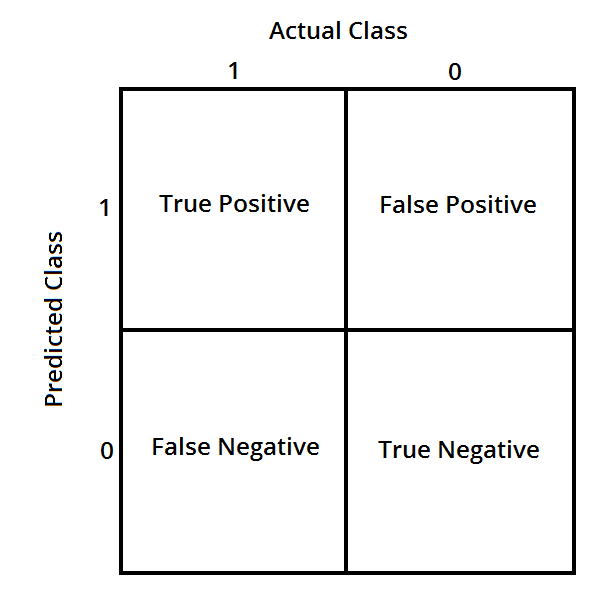

## Prioritizing What to Work On

Different ways we can approach a machine learning problem:

- Collect lots of data.
- Develop sophisticated features (for example: using email header data in spam emails).
- Develop algorithms to process your input in different ways (recognizing misspellings in spam).

It is difficult to tell which of the options will be helpful.

## Error Analysis

The recommended approach to solving machine learning problems is:

- Start with a simple algorithm, implement it quickly, and test it early.
- Plot learning curves to decide if more data, more features, etc. will help
- Error analysis: manually examine the errors on examples in the cross validation set and try to spot a trend.

It's important to get error results as a single, numerical value. Otherwise it is difficult to assess your algorithm's performance.

You may need to process your input before it is useful. For example, if your input is a set of words, you may want to treat the same word with different forms (fail/failing/failed) as one word, so must use **stemming software** to recognize them all as one.

## Error Metrics for Skewed Classes

It is sometimes difficult to tell whether a reduction in error is actually an improvement of the algorithm.

- For example: In predicting a cancer diagnoses where 0.5% of the examples have cancer, we find our learning algorithm has a 1% error. However, if we were to simply classify every single example as a $0$, then our error would reduce to 0.5% even though we did not improve the algorithm.

This usually happens with **skewed classes**; that is, when the ratio of _positive_ to _negative_ examples is very clode to one of the two extremes.

For this we can use **Precision/Recall**.

**Precision**: (of all patients we predicted where y=1, what fraction actually has cancer?)

$$
\frac{\text{True Positives}}{\text{Total number of predicted positives}}=\frac{\text{True Positives}}{\text{True Positives}+ \text{False positives}}
$$

**Recall**: (Of all the patients that actually have cancer, what fraction did we correctly detect as having cancer?)

$$
\frac{\text{True Positives}}{\text{Number of actual positives}}= \frac{\text{True Positives}}{\text{True Positives}+ \text{False negatives}}
$$

These two metrics give us a better sense of how our classifier is doing. We want both precision and recall to be high.

In the example at the beginning of the section, if we classify all patients as $0$, then our **recall** will be $\frac{0}{0+f}=0$, so despite having a lower error percentage, we can quickly see it has worse recall.

## Trading Off Precision and Recall

We might want a **confident** prediction of two classes using logistic regression. One way is to increase our threshold:

Predict $1$ if: $h_{\theta}(x) \ge 0.7$

Predict $0$ if: $h_{\theta}(x) < 0.7$

This way, we only predict cancer if the patient has a $70%$ chance.

Doing this, we will have **higher precision** but **lower recall**.

In the opposite example, we can lower our threshold:

Predict $1$ if: $h_{\theta}(x) \ge 0.3$

Predict $0$ if: $h_{\theta}(x) < 0.3$

That way, we get a very **safe** prediction. This will cause **higher recall** but **lower precision**.

> The greater the threshold, the greater the precision and the lower the recall.
>
> The lower the threshold, the greater the recall and the lower the precision.

In order to turn these two metrics into one single number, we can take the **F value**.

One way is to take the **average**:

$$
\frac{F + R}{2}
$$

This does not work well. If we predict all $y=0$ then that will bring the average up despite having $0$ recall. If we predict all examples as $y=1$, then the very high recall will bring up the average despite having $0$ precision.

A better way is to compute the **F Score** (or F1 score):

$$
\frac{2PR}{P + R}
$$

In order for the F Score to be large, both precision and recall must be large. We want to train precision and recall on the **cross validation set** so as not to bias our test set.

## Data for Machine Learning

How much data should we train on?

In certain cases, an "inferior algorithm," if given enough data, can outperform a superior algorithm with less data.

We must choose our features to have **enough** information. A useful test is: Given input $x$, would a human expert be able to confidently predict $y$?

**Rationale for large data**: if we have a **low bias** algorithm (many features or hidden units making a very complex function), then the larger the training set we use, the less we will have overfitting (and the more accurate the algorithm will be on the test set).
