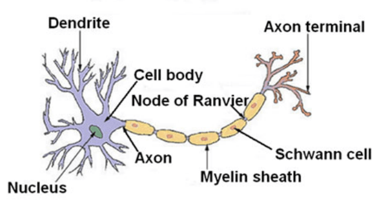
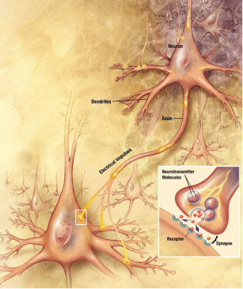

# Neural Networks: Representation

## Non-linear Hypothesis

Performing linear regression with a complex set of data with many features is very unwieldy. Say you wanted to create a hypothesis from three features that included all the quadratic terms:

$$
g(\theta_0+\theta_1x^2_1+\theta_2x_1x_2+\theta_3x_1x_3+\theta_4x_2^2+\theta_5x_2x_3+\theta_6x^2_3)
$$

That gives us $6$ features. For $100$ features, if we wanted to make them quadratic we would get $5050$ resulting new features.

We can approximate the growth of the number of new features we get with all quadratic terms with $O(n^2/2)$. And if you wanted to include all cubic terms in your hypothesis, the features would grow asymptotically at $O(n^3)$. These are very steep growths, so as the number of our features increase, the number of quadratic or cubic features increase very rapidly and becomes quickly impractical.

Example: let our training set be a collection of $50 \times 50$ pixel black-and-white photographs, and our goal will be to classify which ones are photos of cars. Our feature set size is then $n=2500$, if we compare every pair of pixels.

Now let's say we need to make a quadratic hypothesis function. With quadratic features, our growth is $O(n^2/2)$. So our total features will be about $2500^2/2=3125000$, which is very impractical.

Neural networks offers an alternate way to perform machine learning when we have complex hypotheses with many features.

## Neurons and the Brain

Neural networks are limited imitations of how our own brains work. At a very simple level, neurons are basically computational units that take input (**dendrites**) as electrical input (called **spikes**) that are channeled to outputs (**axons**).

<!--{.img-center}-->

<!--{.img-center}-->

## Model Representation I

Let's examine how we will represent a hypothesis function using neural networks.

In our model, our dendrites are like the input features $(x_1 \cdots x_n)$, and the output is the result of our hypothesis function:

Visually, a simplistic representation looks like:

$$
\begin{align}
\begin{bmatrix}
x_0 \\
x_1 \\
x_2
\end{bmatrix} \rightarrow
[ \hspace{1em}] \rightarrow
h_\Theta(x)
\end{align}
$$

In this model our $x_0$ input node is sometimes called the **bias unit**. It is always equal to 1.

In neural networks, we use the same logistic function as in classification: $\frac{1}{1+e^{−θ^Tx}}$, however we sometimes call it a sigmoid (logistic) **activation** function and the **theta** parameters are sometimes instead called **weights**.

Our input nodes (layer 1) go into another node (layer 2), and are output as the hypothesis function.

The first layer is called the **input layer** and the final layer the **output layer**, which gives the final value computed on the hypothesis.

We can have intermediate layers of nodes between the input and output layers called the **hidden layer**.

We label these intermediate or **hidden** layer nodes as $a^{(2)}_0 \cdots a^{(2)}_n$ and call them **activation units**.

$$
\begin{align*}
& a^{(j)}_i =  \text{activation of unit }i \text { in layer } j \\
& \Theta^j = \text{matrix of weights controlling function mapping from layer } j \text{ to layer } j+1
\end{align*}
$$

If we had one hidden layer, it would look visually something like:

$$
\begin{align*}
\begin{bmatrix}
x_0 \\
x_1 \\
x_2 \\
x_3
\end{bmatrix} \rightarrow
\begin{bmatrix}
a^{(2)}_1 \\
a^{(2)}_2 \\
a^{(2)}_3 \\
\end{bmatrix} \rightarrow
h_\Theta(x)
\end{align*}
$$

The values for each of the **activation** nodes is obtained as follows:

$$
\begin{align*}
& a^{(2)}_1 = g(\Theta^{(1)}_{1,0} x_0 + \Theta^{(1)}_{1,1} x_1 + \Theta^{(1)}_{1,2} x_2 +\Theta^{(1)}_{1,3} x_3) \\
& a^{(2)}_2 = g(\Theta^{(1)}_{2,0} x_0 + \Theta^{(1)}_{2,1} x_1 + \Theta^{(1)}_{2,2} x_2 +\Theta^{(1)}_{2,3} x_3) \\
& a^{(2)}_3 = g(\Theta^{(1)}_{3,0} x_0 + \Theta^{(1)}_{3,1} x_1 + \Theta^{(1)}_{3,2} x_2 +\Theta^{(1)}_{3,3} x_3) \\
\end{align*}
$$

And Our hypothesis output is calculated as follows:

$$
h_\Theta(x) = g(\Theta^{(2)}_{1,0} a^{(2)}_0 + \Theta^{(2)}_{1,1} a^{(2)}_1 + \Theta^{(2)}_{1,2} a^{(2)}_2 +\Theta^{(2)}_{1,3} a^{(2)}_3)
$$

Each layer ($j$) gets its own matrix of weights, $\Theta^{(j)}$. The dimensions of these matrices of weights is determined as follows:

If network has $s_j$ units in layer $j$ and $s_{j+1}$ units in layer $j+1$, then $\Theta(j)$ will be of dimension $s_{j+1} \times (s_j+1)$.

The $+1$ comes from the addition of **bias nodes**, $x_0$ and $\Theta(j)$,in $\Theta(j)$. In other words the output nodes will not include the bias nodes while the inputs will.

Example: if layer 1 has $2$ input nodes and layer 2 has $4$ activation nodes, the dimension of $\Theta{(^1)}$ is going to be $4 \times 3$ where $s_j=2$ and $s_{j+1}=4$, so $s_{j+1} \times (s_j+1)=4 \times 3$.

## Model Representation II

In this section we'll do a vectorized implementation of the above functions. We're going to define a new variable $z^{(j)}_k$ so that we have encompasses the parameters inside our $g$ function. In our previous example if we replaced the variable $z$ for all the parameters we would get:

$$
\begin{align*}
a^{(2)}_1 &= g(z^{(2)}_1) \\
a^{(2)}_2 &= g(z^{(2)}_2) \\
a^{(2)}_3 &= g(z^{(2)}_3) \\  \\
\text{where :} \\
z^{(2)}_1 &= \Theta^{(1)}_{1,0} x_0 + \Theta^{(1)}_{1,1} x_1 + \Theta^{(1)}_{1,2} x_2 +\Theta^{(1)}_{1,3} x_3 \\
z^{(2)}_2 &= \Theta^{(1)}_{2,0} x_0 + \Theta^{(1)}_{2,1} x_1 + \Theta^{(1)}_{2,2} x_2 +\Theta^{(1)}_{2,3} x_3 \\
z^{(2)}_3 &= \Theta^{(1)}_{3,0} x_0 + \Theta^{(1)}_{3,1} x_1 + \Theta^{(1)}_{3,2} x_2 +\Theta^{(1)}_{3,3} x_3
\end{align*}
$$

These $z$ values are just a weighted linear combination of input values $x_0$, $x_1$, $x_2$, $x_3$ that go into particular neuron.

Let's define vector $x$ and $z^{(2)}$ as follows:

$$
\begin{align*}
&x = \begin{bmatrix}
x_0 \\
x_1 \\
x_2 \\
x_3 \\
\end{bmatrix} \hspace{1em}
z^{(2)} =
\begin{bmatrix}
z^{(2)}_1 \\
z^{(2)}_2 \\
z^{(2)}_3 \\
\end{bmatrix} \\ \\
&\text{ where } x_0 = 1
\end{align*}
$$

Now we can vectorize the computation of $a^{(2)}_1$, $a^{(2)}_2$, $a^{(2)}_3$ as follows:

$$
a^{(2)} = g(z^{(2)})
$$

where our function $g$ can be applied element-wise to our vector $ z^{(2)}$.

We can compute $z^{(2)}$ by setting $x=a^{(1)}$ as:

$$
z^{(2)} = \Theta^{(1)}a^{(1)}
$$

We can then **add a bias unit** $a^{(2)}_0 = 1$ and compute $z^{(3)}$ as:

$$
z^{(3)} = \Theta^{(2)} a^{(2)}
$$

We then get our final result with:

$$
h_\Theta(x) = a^{(3)} = g(z^{(3)})
$$

This process is also called **Forward Propagation**. We are doing **exactly the same thing** as we did in logistic regression.

Adding all these intermediate layers in neural networks allows us to more elegantly produce interesting and more complex non-linear hypotheses.

## Examples and Intuitions I

A simple example of applying neural networks is by predicting $x_1 \text{ AND } x_2$, which is the logical `and` operator and is only true if both $x_1$ and $x_2$ are $1$.

The graph of our functions will look like:

$$
\begin{align*}
\begin{bmatrix}
x_0 \\
x_1 \\
x_2
\end{bmatrix} \rightarrow
\begin{bmatrix}
g(z^{(2)})
\end{bmatrix} \rightarrow
h_\Theta(x)
\end{align*}
$$

Remember that $x_0$ is our bias variable and is always $1$.

Let's set our first theta matrix as:

$$
\begin{align*}
&\Theta^{(1)} =
\begin{bmatrix}
-30 \hspace{1em} 20 \hspace{1em} 20
\end{bmatrix} \\
\\ \implies &h_\Theta(x) = -30+20x_1 + 20x_2
\end{align*}
$$

This will cause the output of our hypothesis to only be positive if both $x_1$ and $x_2$ are $1$.

| $x_1$ | $x_2$ |    $h_\Theta(x)$    |
| :---: | :---: | :-----------------: |
|  $0$  |  $0$  | $g(-30) \approx  0$ |
|  $0$  |  $1$  | $g(-10) \approx  0$ |
|  $1$  |  $0$  | $g(-10) \approx  0$ |
|  $1$  |  $1$  | $g(10) \approx  1$  |

So we have constructed one of the fundamental operations in computers by using a small neural network rather than using an actual AND gate. Neural networks can also be used to simulate all the other logical gates.

Similarly, $\Theta^{(1)}$ for other operations are

$$
\begin{align*}
x_1 \space AND \space x_2: \\
\Theta_1 &= \begin{bmatrix}-30 & 20 & 20\end{bmatrix} \\
x_1 \space OR \space x_2: \\
\Theta_1 &= \begin{bmatrix}-10 & 20 & 20\end{bmatrix} \\
NOT \space x_1: \\
\Theta_1 &= \begin{bmatrix}10 &- 20 \end{bmatrix} \\
x_1 \space NOR \space  x_2: \\
\Theta_1 &= \begin{bmatrix}10 & -20 & -20\end{bmatrix}
\end{align*}
$$

We can combine these to get the XNOR logical operator (which gives $1$ if neither  $x_1$ nor $x_2$ are both $0$ or both $1$).

$$
\begin{bmatrix}
x_0 \\
x_1 \\
x_2
\end{bmatrix}
\rightarrow
\begin{bmatrix}
a^{(2)}_0 \\
a^{(2)}_1 \\
a^{(2)}_2 \\
\end{bmatrix}
\rightarrow
\begin{bmatrix}
a^{(3)}_0 \\
a^{(3)}_1 \\
\end{bmatrix}
\rightarrow
h_\Theta(x)
$$

For the transition between the first and second layer, we'll use a $\Theta^{(1)}$ matrix that combines the values for AND and NOR:

$$
\begin{align*}
\Theta^{(1)} =
\begin{bmatrix}
-30 & 20 & 20 \\
10 & -20  & -20
\end{bmatrix}
\end{align*}
$$

For the transition between the second and third layer, we'll use a $\Theta^{(2)}$ matrix that uses the value for OR:

$$
\begin{align*}
\Theta^{(2)} =
\begin{bmatrix}
-10 & 20 & 20
\end{bmatrix}
\end{align*}
$$

Let's write out the values for all our nodes:

$$
\begin{align*}
a^{(2)} &= g(\Theta^{(1)} \cdot x) \\
h_\Theta & = a^{(3)} = g(\Theta^{(2)} \cdot a^{(2)})
\end{align*}
$$

The result will be as follows:

| $x_1$ | $x_2$ |    $a^{(2)}_1$     |    $a^{(2)}_2$     |   $h_\Theta(x)$    |
| :---: | :---: | :----------------: | :----------------: | :----------------: |
|  $0$  |  $0$  | $g(-30) \approx 0$ | $g(10) \approx 1$  | $g(10) \approx 1$  |
|  $0$  |  $1$  | $g(-10) \approx 0$ | $g(-10) \approx 0$ | $g(-10) \approx 0$ |
|  $1$  |  $0$  | $g(-10) \approx 0$ | $g(-10) \approx 0$ | $g(-10) \approx 0$ |
|  $1$  |  $1$  | $g(10) \approx 1$  | $g(-30) \approx 0$ | $g(10) \approx 1$  |

And thus we have the XNOR operator using one hidden layer!

## Multiclass Classification

To classify data into multiple classes, we let our hypothesis function **return a vector of values**. Say we wanted to classify our data into one of four final resulting classes, our final layer of nodes, will be a vector of size $4$:

$$
\begin {bmatrix}
x_0 \\
x_1 \\
x_2 \\
\vdots \\
x_n
\end{bmatrix}
\rightarrow
\begin {bmatrix}
a^{(2)}_0 \\
a^{(2)}_1 \\
a^{(2)}_2 \\
\vdots \\
\end{bmatrix}
\rightarrow
\begin {bmatrix}
a^{(3)}_0 \\
a^{(3)}_1 \\
a^{(3)}_2 \\
\vdots \\
\end{bmatrix}
\rightarrow \cdots
\rightarrow
\begin {bmatrix}
h_\Theta(x)_1 \\
h_\Theta(x)_2 \\
h_\Theta(x)_3 \\
h_\Theta(x)_4 \\
\end{bmatrix}
$$

Our resulting hypothesis for one set of inputs may look like:

$$
h_\Theta(x) =
\begin{bmatrix}
0 \\ 0 \\ 1 \\ 0
\end{bmatrix}
$$

In which case our resulting class is the third one down, or $h_\Theta(x)_3$.

We can define our set of resulting classes as $y$:

$$
y^{(i)} =
\begin{bmatrix}1 \\ 0 \\ 0 \\ 0 \end{bmatrix} \text{ or }
\begin{bmatrix}0 \\ 1 \\ 0 \\ 0 \end{bmatrix} \text{ or }
\begin{bmatrix}0 \\ 0 \\ 1 \\ 0 \end{bmatrix} \text{ or }
\begin{bmatrix}0 \\ 0 \\ 0 \\ 1 \end{bmatrix}
$$

Our final value of our hypothesis for a set of inputs will be one of the elements in $y$.
