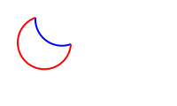
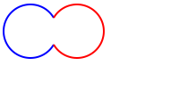
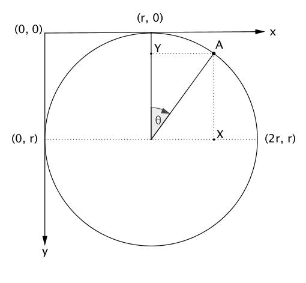

As an exercise on learning how SVG works, I decided to create a pie/donut-chart using nothing but vanilla JS (Yes, not even d3!).

## SVG coordinate system and arcs

For creating any charts, we need to understand few things about SVG first.

Unlike, normal graph coordinate system, the SVG coordinate has its Y-axis reversed. As you increase y-coordinates, the point moves down instead of up and vice-versa. (You can read more about it [here](http://tutorials.jenkov.com/svg/svg-coordinate-system.html)).

Next, to draw an arc, we will be using `path` element of SVG, and we need a starting-point, radius and an end-point for it. A typical arc path looks something like this:

```html
<path d="M40,20  A30,30 0 0,1 70,70" style="stroke: #0000ff; stroke-width:2; fill:none;" />
```

We will focus mainly on `d` attribute. The two parameters after `M` indicate a starting point. The two parameters after `A` indicate the `x-radius` and `y-radius` of the arc respectively. The third parameter after `A` indicates `x-axis-rotation` and can be ignored for now.

The fourth and fifth parameters after `A` indicate `large-arc-flag` and `sweep-flag` respectively. Given any two points, only two arcs can be drawn through them with give radii and it controlled using `large-arc-flag`. As shown below, the blue arc is the smaller one (denoted by `0`) and the the red arc is the the larger one (denoted by `1`).



The `sweep-flag` controls whether the arc is be to drawn in counter-clockwise direction (denoted by `0` and shown in blue) or clock-wise-direction (denoted by `1` and shown in red).



For more detailed info, you can [read this](http://tutorials.jenkov.com/svg/path-element.html#arcs)

## The Math

The following is a diagram of a circle in the SVG coordinate-system. We assume that `r` is the radius of the the circle.



Now suppose we want the coordinates of a point `A` on the circle which has an angle <code>θ</code> from vertical axis, we will make projections of `A` on horizontal and vertical axis as <code><i>X</i></code> and <code><i>Y</i></code> respectively. By using basic trigonometry we get:

```
X = r + r * sinθ = r (1 + sinθ)
Y = r - r * cosθ = r (1 - cosθ)

Thus A = [r (1+ sinθ), r(1 - cosθ)]
```

For a donut chart, we will need to make another smaller circle with radius `r'` where `r' < r`. And similar to above example, we get coordinates of a point on this smaller circle as

```
[r' (1+ sinθ), r'(1 - cosθ)]
```

To make a donut-chart, we need to make these circles concentric (have same centers), thus, we need to shift the smaller circle by `r - r'` in both directions. Thus the updated coordinates for smaller circle are:

```
[(r'(1 + sinθ)) + (r - r'), (r'(1 - cosθ)) + (r - r')] = [r + r'sinθ, r - r'cosθ]
```

## Drawing an arc

Now we will learn how to draw an arc <code>PQRS</code> as shown in picture below. We assume that the start angle of the arc is <code>α</code> and the end angle is <code>β</code>. We also assume that the inner-radius <code><i>OS</i></code> is <code>r<sub>1</sub></code> the outer-radius <code><i>OP</i></code> is <code>r<sub>2</sub></code>.


From the above section, we can concluded that

```

P = [r2 + r2 sinα, r2  - r2 cosα]
Q = [r2 + r2 sinβ, r2  - r2 cosβ]
R =[r2 + r1 sinβ, r2  - r1 cosβ]
S = [r2 + r1 sinα, r2  - r1 cosα]

```

For drawing the arc, we will start from point `P(x, y)`. Thus, we can write:

```html
<path d="M P.x,P.y" />
```

Next we move **clock-wise** to point `Q(x, y)` with radius <code>r<sub>2</sub></code>. Thus, we can write:

```html
<path d="M P.x,P.y A r2,r2 0 0,1 Q.x,Q.y" />
```

Next we move to point `R(x, y)`. Thus we can write:

```html
<path d="M P.x,P.y A r2,r2 0 0,1 Q.x,Q.y L R.x,R.y" />
```

Next we move **counter clock-wise** to point `S(x, y)` with radius <code>r<sub>1</sub></code>. Thus, we can write:

```html
<path d="M P.x,P.y A r2,r2 0 0,1 Q.x,Q.y L R.x,R.y A r1,r1 0 0,0 S.x,S.y Z" />
```

The final `Z` is to close the path.

There is one last bit remaining. We need to decide whether to use large-arc or small-arc (flip `large-arc-flag`) based on the angle of the arc <code>(β - α)</code>. If it is greater than <code>&pi;</code>, we must use large-arc else small-arc.

The final javascript code will look like this:

```js
function arc(startAngle, endAngle, outerRadius, innerRadius = 0) {
  const sinAlpha = Math.sin(startAngle);
  const cosAlpha = Math.cos(startAngle);
  const sinBeta = Math.sin(endAngle);
  const cosBeta = Math.cos(endAngle);

  const largeArc = endAngle - startAngle > Math.PI;

  const P = {
    x: outerRadius + outerRadius * sinAlpha,
    y: outerRadius - outerRadius * cosAlpha,
  };

  const Q = {
    x: outerRadius + outerRadius * sinBeta,
    y: outerRadius - outerRadius * cosBeta,
  };

  const R = {
    x: outerRadius + innerRadius * sinBeta,
    y: outerRadius - innerRadius * cosBeta,
  };

  const S = {
    x: outerRadius + innerRadius * sinAlpha,
    y: outerRadius - innerRadius * cosAlpha,
  };

  return `M${P.x},${P.y} A${outerRadius},${outerRadius} 0 ${largeArc ? '1,1' : '0,1'} ${Q.x},${
    Q.y
  } L${R.x},${R.y} A${innerRadius},${innerRadius} 0 ${largeArc ? '1,0' : '0,0'} ${S.x},${S.y} Z`;
}
```

## Plotting the chart with data

Suppose you have data in the the following format:

```js
// random data from https://www.mockaroo.com/
const data = [
  {
    label: 'web-enabled',
    value: 717,
    color: '#460898',
  },
  /* ... */
];
```

Total can be easily calculated using `Array.prototype.reduce`:

```js
const total = data.reduce((p, c) => p + c.value, 0);
```

Now that we have raw data and total, we have to scale the data linearly between `0` and `2π`

```js
function scale(value) {
  return (value * Math.PI * 2) / total;
}
```

Now we can loop over the data and plot the chart. You can use any of your favorite frameworks like React, Vue, etc., or not and simply use vanilla JS as follows:

```js
const fragment = document.createDocumentFragment();

const outerRadius = 300;
const innerRadius = 150;

let startAngle = 0;

data.forEach((slice) => {
  const { value, color, label } = slice;
  const sectorAngle = scale(value);
  const d = arc(startAngle, startAngle + sectorAngle, outerRadius, innerRadius);

  startAngle += sectorAngle;

  const path = document.createElementNS('http://www.w3.org/2000/svg', 'path');
  const title = document.createElementNS('http://www.w3.org/2000/svg', 'title');
  title.innerHTML = label;
  path.setAttribute('d', d);
  path.setAttribute('fill', color);
  path.appendChild(title);
  fragment.appendChild(path);
});

document.getElementById('pie').appendChild(fragment); // assuming there is an svg with #pie available
```

And we are done. Now you'll a functional pie/donut chart without the need of d3!

## Final Result

You can have a look at the final result in the codepen demo below.

<iframe
	height="265"
	scrolling="no"
	title="donut-chart-no-d3"
	src="//codepen.io/vkbansal/embed/preview/pevBoP/?height=265&theme-id=0&default-tab=result&embed-version=2"
	frameborder="no"
	allowtransparency="true"
	allowfullscreen="true"
	style="width: 100%;"
>
	See the Pen <a href="http://codepen.io/vkbansal/pen/pevBoP/">donut-chart-no-d3</a> by Vivek Kumar
	Bansal (<a href="http://codepen.io/vkbansal">@vkbansal</a>) on{' '}
	<a href="http://codepen.io">CodePen</a>.
</iframe>
