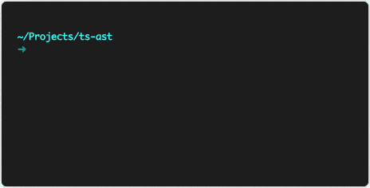

[This wiki section](https://github.com/Microsoft/TypeScript/wiki/Using-the-Compiler-API#creating-and-printing-a-typescript-ast) of TypeScript github project covers how to print an AST (Abstract Syntax Tree) node, but it does not cover how to update and print an entire file (at the time of writing this post).

After a lot of trial and error, I came up with the following. I don't know whether its the right way to do it but it works:

```ts
import ts from 'typescript';

// Create a Printer
const printer = ts.createPrinter({
    newLine: ts.NewLineKind.LineFeed,
    removeComments: false,
    omitTrailingSemicolon: true
});

// Create a source file
const sourceFile = ts.createSourceFile(
    'someFileName.ts',
    '',
    ts.ScriptTarget.Latest,
    /*setParentNodes*/ false,
    ts.ScriptKind.TS
);

const myASTNode_1 = /* Your AST */;
const myASTNode_2 = /* Your AST */;
const myASTNode_3 = /* Your AST */;
// etc

// Update the source file statements
sourceFile.statements = ts.createNodeArray(
    [ myASTNode_1, myASTNode_2, myASTNode_3, .... ]
);

// Print the new code
console.log(printer.printFile(sourceFile));
```

So first we create a `ts.Printer` object and an empty `ts.SourceFile`. The code in a `SourceFile` is located in the `statements` key which is of type `ts.NodeArray`. Hence, we use the `ts.createNodeArray` function to generate `ts.NodeArray` and replace the `statements`.

I've created a small example [here](https://gist.github.com/vkbansal/379460892f12e0b8bb50434e52e6368f). You can clone it and try for yourselves.

```bash
git clone https://gist.github.com/vkbansal/379460892f12e0b8bb50434e52e6368f ts-ast
cd ts-ast
yarn install # or npm install
yarn start # or npm start
```

It should look something like this:


