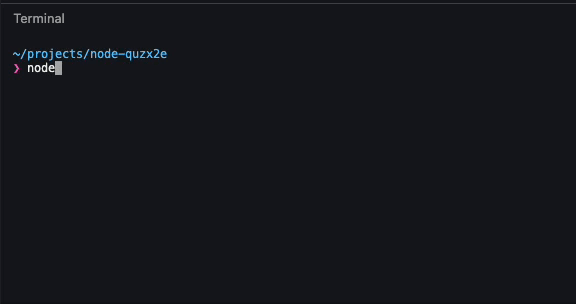

Recently, while working on a project, I came across a use case, where in I needed to resolve the `tsconfig.json` and read the option `moduleResolution` from the config. I tried looking up this in the official docs, but could not find anything. After scavenging the internet, I came across [this gist](https://gist.github.com/jeremyben/4de4fdc40175d0f76892209e00ece98f), which gave me the solution. I'll try to explain the solution as best as I can.

Turns out, this is a two step process. In first step, you resolve the configuration file by using the `findConfigFile` method and in second step you read the file (from first step) using `readConfigFile` method. Below is the code for the same:

```typescript
import ts from 'typescript';

const currentDir = process.cwd();
const configFile = ts.findConfigFile(currentDir, ts.sys.fileExists, 'tsconfig.json');

if (configFile) {
  const { config } = ts.readConfigFile(configFile, ts.sys.readFile);
  // config will be the resolved object
}
```

## Example

I have created [an example on StackBlitz](https://stackblitz.com/edit/node-quzx2e?file=index.js). It has the follwing directory structure:

```
|- test/
|    |- tsconfig.json
|- index.js
|- package.json
|- tsconfig.json
```

And following content:

```javascript
// index.js
import ts from 'typescript';

const currentDir = process.cwd();
const configFile = ts.findConfigFile(currentDir, ts.sys.fileExists, 'tsconfig.json');

console.log('configFile =>', configFile);

if (configFile) {
  const { config } = ts.readConfigFile(configFile, ts.sys.readFile);

  console.log('moduleResolution =>', config.compilerOptions.moduleResolution);
}
```

```json
// tsconfig.json
{
  "compilerOptions": {
    "baseUrl": ".",
    "target": "esnext",
    "moduleResolution": "NodeNext"
  }
}
```

```json
// test/tsconfig.json
{
  "extends": "../tsconfig.json",
  "compilerOptions": {
    "moduleResolution": "Node"
  }
}
```

Now if you run `node index.js` in the project's root directory, you'll see that `moduleResolution` is logged as `NodeNext`.

And if you run `node ../index.js` from inside the `test` directory, you'll see that `moduleResolution` is logged as `Node`.

This works as expected.



You can try it below:

<iframe width="700" height="500" src="https://stackblitz.com/edit/node-quzx2e?ctl=1&embed=1&file=index.js&view=editor" ></iframe>
