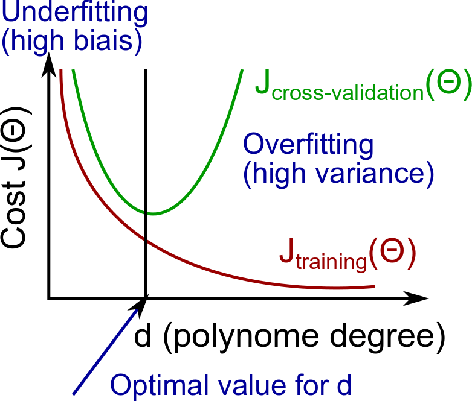
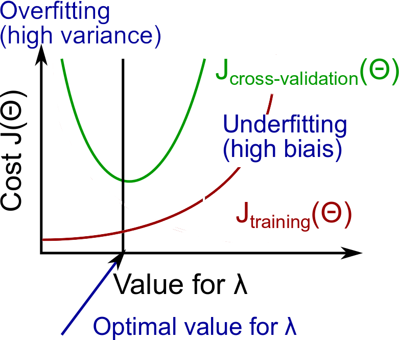

import Blog from 'layouts/Blog.astro';

<Blog content={frontmatter}>

## Deciding What to Try Next

Errors in your predictions can be troubleshooted by:

- Getting more training examples
- Trying smaller sets of features
- Trying additional features
- Trying polynomial features
- Increasing or decreasing $\lambda$

Don't just pick one of these avenues at random. We'll explore diagnostic techniques for choosing one of the above solutions in the following sections.

## Evaluating a Hypothesis

A hypothesis may have low error for the training examples but still be inaccurate (because of overfitting).

With a given dataset of training examples, we can split it up the data into two sets: a **training set** (70%) and a **test set** (30%).

The new procedure using these two sets is then:

1. Learn &Theta; and minimize <code>Jtrain&Theta;</code> using the training set.
2. Compute the test set error<code>Jtest&Theta;</code>.

### The test set error

**For linear regression**:

$$
 Jtrain&Theta;=\frac{1}{2m_{test}}\sum_{i=1}^{m_{test}} \left(h_\Theta(x^{(i)}_{test})−y^{(i)}_{test}\right)^2
$$

**For classification**:

Misclassification error (aka 0/1 misclassification error):

$$
\begin{align*}
  err(h_\Theta(x), y)=
  \begin{matrix}
  & 1  &\text{ if }h_\Theta(x) \geq 0.5 \text{ and } y=0   \text{ or } h_\Theta(x) < 0.5 \text{ and } y = 1 \\
  & 0 &\text { otherwise}\end{matrix}
  \end {align*}
$$

This gives us a binary $0$ or $1$ error result based on a misclassification.

The average test error for the test set is

$$
\text{Test Error} = \frac{1}{m_{test}} \sum^{m_{test}}_{i=1} err(h_\Theta(x^{(i)}_{test}),y^{(i)}_{test})
$$

This gives us the proportion of the test data that was misclassified.

## Model Selection and Train/Validation/Test Sets

Just because a learning algorithm fits a training set well, that does not mean it is a good hypothesis. The error of your hypothesis as measured on the data set with which you trained the parameters will be lower than any other data set.

In order to choose the model of your hypothesis, you can test each degree of polynomial and look at the error result.

1. Optimize the parameters in $\Theta$ using the training set for each polynomial degree.
2. Find the polynomial degree $d$ with the least error using the test set.
3. Estimate the generalization error also using the test set with $J_{test}(\Theta^{(d)})$, (d = theta from polynomial with lower error);

In this case, we have trained one variable, $d$, or the degree of the polynomial, using the test set. This will cause our hypothesis to work well only the test set and the error value will be greater for any other set of data.

To solve this, we can introduce a third set, the **Cross Validation Set**, to serve as an intermediate set that we can train $d$ with. Then our test set will give us an accurate, non-optimistic error.

One example way to break down our dataset into the three sets is:

- Training set: 60%
- Cross validation set: 20%
- Test set: 20%

We can now calculate three separate error values for the three different sets:

1. Optimize the parameters in $\Theta$ using the training set for each polynomial degree.
2. Find the polynomial degree $d$ with the least error using the cross validation set.
3. Estimate the generalization error using the test set with $J_{test}(\Theta^{(d)})$, (d = theta from polynomial with lower error);

This way, the degree of the polynomial $d$ has not been trained using the test set.

## Diagnosing Bias vs. Variance

In this section we examine the relationship between the degree of the polynomial d and the underfitting or overfitting of our hypothesis.

- We need to distinguish whether **bias** or **variance** is the problem contributing to bad predictions.
- High bias is underfitting and high variance is overfitting. We need to find a golden mean between these two.

The training error will tend to **decrease** as we increase the degree $d$ of the polynomial.

At the same time, the cross validation error will tend to **decrease** as we increase d up to a point, and then it will **increase** as d is increased, forming a convex curve.

The is represented in the figure below:

<!--{.img-center}-->

## Regularization and Bias/Variance

Instead of looking at the degree $d$ contributing to bias/variance, now we will look at the regularization parameter $\lambda$.

A large lambda heavily penalizes all the $\Theta$ parameters, which greatly simplifies the line of our resulting function, so causes underfitting. On the other hand, if use small $\lambda$, the resulting function may have high variance.

The figure below illustrates the relationship between lambda and the cost:

<!--{.img-center}-->

In order to choose the model and the regularization $\lambda$, we need:

1. Create a list of lambda (i.e.$ λ \in \{0,0.01,0.02,0.04,0.08,0.16,0.32,0.64,1.28,2.56,5.12,10.24\}$);
2. Select a lambda to compute;
3. Create a model set like degree of the polynomial or others;
4. Select a model to learn $\Theta$;
5. Learn the parameter $\Theta$ for the model selected, using <code>Jtrain&Theta;<code> **with** $\lambda$ selected (this will learn $\Theta$ for the next step);
6. Compute the train error using the learned $\Theta$ (computed with $\lambda$ ) on the <code>Jtrain&Theta;<code> **without** regularization or $\lambda = 0$;
7. Compute the cross validation error using the learned $\Theta$ (computed with $\lambda$) on the <code>JCV&Theta;<code> **without** regularization or $\lambda = 0$;
8. Do this for the entire model set and lambdas, then select the best combo that produces the lowest error on the cross validation set;
9. Now if you need visualize to help you understand your decision, you can plot to the figure like above with: ($\lambda \times \text{Cost } J_{train}(\Theta)$) and ($\lambda \times \text{Cost } J_{CV}(\Theta)$);
10. Now using the best combo $\Theta$ and $\lambda$, apply it on <code>Jtest&Theta;<code> to see if it have a good generalization of the problem.
11. To help decide the best polynomial degree and $\lambda$ to use, we can diagnose with the learning curves, that is the next subject.

## Learning Curves

Training $3$ examples will easily have $0$ errors because we can always find a quadratic curve that exactly touches $3$ points.

- As the training set gets larger, the error for a quadratic function increases.
- The error value will plateau out after a certain $m$, or training set size.

**With high bias :**

- **Low training set size**: causes <code>Jtrain&Theta;<code> to be low and <code>JCV&Theta;<code> to be high.

* **Large training set size**: causes both <code>Jtrain&Theta;<code> and <code>JCV&Theta;<code> to be high with $ J*{train}(\Theta)\approx J*{CV}(\Theta)$.

If a learning algorithm is suffering from **high bias**, getting more training data **will not (by itself) help much**.

For high variance, we have the following relationships in terms of the training set size:

**With high variance :**

- **Low training set size**: <code>Jtrain&Theta;<code> will be low and <code>JCV&Theta;<code> will be high.

* **Large training set size**: <code>Jtrain&Theta;<code> increases with training set size and <code>JCV&Theta;<code> continues to decrease without leveling off. Also, $J_{train}(\Theta) < J_{CV}(\Theta)$ but the difference between them remains significant.

If a learning algorithm is suffering from **high variance**, getting more training data is **likely to help.**

**Learning curve for high bias (at fixed model complexity)**

**Learning curve for high variance (at fixed model complexity)**

## Deciding What to Do Next Revisited

Our decision process can be broken down as follows:

- Getting more training examples => Fixes **high variance**
- Trying smaller sets of features => Fixes **high variance**
- Adding features => Fixes **high bias**
- Adding polynomial features => Fixes **high bias**
- Decreasing $\lambda$ Fixes **high bias**
- Increasing $\lambda$ Fixes **high variance**

### Diagnosing Neural Networks

- A neural network with fewer parameters is **prone to underfitting**. It is also **computationally cheaper**.
- A large neural network with more parameters is **prone to overfitting**. It is also **computationally expensive**. In this case you can use regularization (increase $\lambda$) to address the overfitting.

Using a single hidden layer is a good starting default. You can train your neural network on a number of hidden layers using your cross validation set.

## Model Selection:

- Choosing $M$ the order of polynomials.

- How can we tell which parameters $\Theta$ to leave in the model (known as **model selection**)?

  There are several ways to solve this problem:

  1. Get more data (very difficult).
  2. Choose the model which best fits the data without overfitting (very difficult).
  3. Reduce the opportunity for overfitting through regularization.

**Bias**: approximation error (Difference between expected value and optimal value)

- High Bias = UnderFitting
- <code>Jtrain&Theta;<code> and $J_{CV}(\Theta)$ both will be high and Jtrain(Θ)≈JCV(Θ)

**Variance**: estimation error due to finite data

- High Variance = OverFitting
- <code>Jtrain&Theta;<code> is low and $J_{CV}(\Theta) \gg J_{train}(\Theta)$

**Intuition for the bias-variance trade-off**:

- Complex model => sensitive to data => much affected by changes in X => high variance, low bias.
- Simple model => more rigid => does not change as much with changes in X => low variance, high bias.

One of the most important goals in learning: finding a model that is just right in the bias-variance trade-off.

#### Regularization Effects:

- Small values of $\lambda$ allow model to become finely tuned to noise leading to large variance => overfitting.
- Large values of $\lambda$ pull weight parameters to zero leading to large bias => underfitting.

#### Model Complexity Effects:

- Lower-order polynomials (low model complexity) have high bias and low variance. In this case, the model fits poorly consistently.
- Higher-order polynomials (high model complexity) fit the training data extremely well and the test data extremely poorly. These have low bias on the training data, but very high variance.
- In reality, we would want to choose a model somewhere in between, that can generalize well but also fits the data reasonably well.

#### A typical rule of thumb when running diagnostics is:

- More training examples fixes high variance but not high bias.
- Fewer features fixes high variance but not high bias.
- Additional features fixes high bias but not high variance.
- The addition of polynomial and interaction features fixes high bias but not high variance.
- When using gradient descent, decreasing lambda can fix high bias and increasing lambda can fix high variance (lambda is the regularization parameter).
- When using neural networks, small neural networks are more prone to under-fitting and big neural networks are prone to over-fitting. Cross-validation of network size is a way to choose alternatives.
  </Blog>
