import Blog from 'layouts/Blog.astro';

<Blog content={frontmatter}>

## Model Representation

In _regression problems_, we taking input variables and trying to fit the output onto a _continuous_ expected result function.

Linear regression with one variable is also known as "univariate linear regression."

Univariate linear regression is used when you want to predict a **single output** value from a **single input** value.

We now introduce notation for equations.

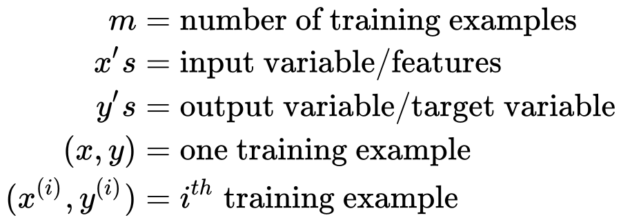{.is-center width=450}

We're doing **supervised learning** here, so that means we already have an idea about what the input/output cause and effect should be.

We feed training set a learning algorithm. Is the job of a learning algorithm to then output a function which by convention is usually denoted lowercase `h` and `h` stands for **hypothesis**. And hypothesis is a function that maps from `x`'s to `y`'s.

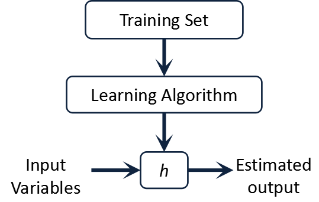{.is-center}

## The Hypothesis Function

Our hypothesis function has the general form: <code>h&theta;(x) = &theta;0 + &theta;1 x</code>

Note that this is like the equation of a straight line and <code>&theta;1</code> is the slope of the line.

We give to <code>h&theta;(x)</code> values for <code>&theta;0</code> and <code>&theta;1</code> to get our output `y`. In other words, we are trying to create a function called <code>h&theta;</code> that is trying to map our input data (the `x`'s) to our output data (the `y`'s).

**Example:**

| x (input) | y (output) |
| :-------: | :--------: |
|     0     |     4      |
|     1     |     7      |
|     2     |     7      |
|     3     |     8      |

Now we can make a random guess about our <code>h&theta;</code> function: <code>&theta;0=2</code> and <code>&theta;1=2</code>. The hypothesis function becomes <code>h&theta;(x)= 2 + 2x</code>.

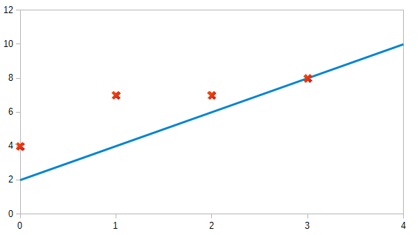{.is-center}

The red crosses indicate `y`'s and the blue line is our hypothesis.

So for input of `1` to our hypothesis, `y` will be `4`. This is off by `3`. Note that we will be trying out various values of <code>&theta;0</code> and <code>&theta;1</code> to try to find values which provide the best possible "fit" or the most representative "straight line" through the data points mapped on the x-y plane.

## Cost Function

We can measure the accuracy of our hypothesis function by using a **cost function**. This takes an average (actually a fancier version of an average) of all the results of the hypothesis with inputs from x's compared to the actual output y's.

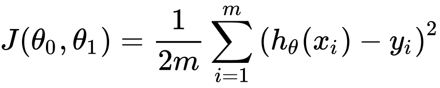{.is-center width=450}

This function is otherwise called the **Squared error function**, or **Mean squared error**. The mean is halved (<code>\dfrac {1}{2m}</code>) as a convenience for the computation of the gradient descent, as the derivative term of the square function will cancel out the <code>\dfrac {1}{2}</code> term.

To break it apart, it is <code>\dfrac {1}{2} x&#x0304;</code> where <code> x&#x0304;</code> is the mean of the squares of <code>h&theta;(x*{i})−y*{i}</code>, or the difference between the predicted value and the actual value as it can be seen in figure below.

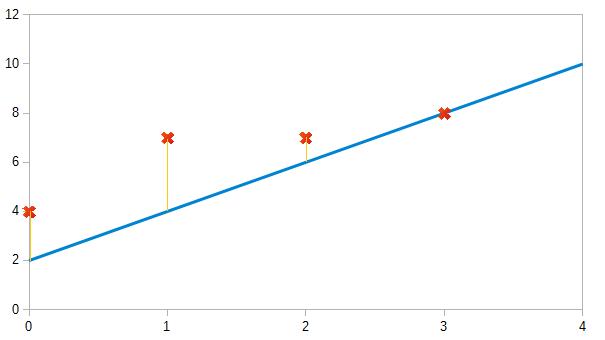{.is-center}

We are trying to make straight line (defined by <code>h&theta;(x)</code>) which passes through our set of data. Our objective is to get the best possible line. The best possible line will be such so that the average distances of the scattered points from the line will be the least. In the best case, the line should pass through all the points of our training data set. In such a case the value of <code>J(&theta;0,&theta;1)</code> will be <code>0</code>.

## Gradient Descent

So we have our hypothesis function and we have a way of measuring how accurate it is. Now what we need is a way to automatically improve our hypothesis function. That's where gradient descent comes in.

If we graph our hypothesis function based on its fields <code>&theta;0</code> and <code>&theta;1</code>.We put <code>&theta;0</code> on the x axis and <code>&theta;1</code> on the y axis, with the cost function on the vertical z axis. The points on our graph will be the result of the **cost function** using our hypothesis with those specific theta parameters. We are not graphing `x`and `y` itself, but the parameter range of our hypothesis function and the cost resulting from selecting particular set of parameters.

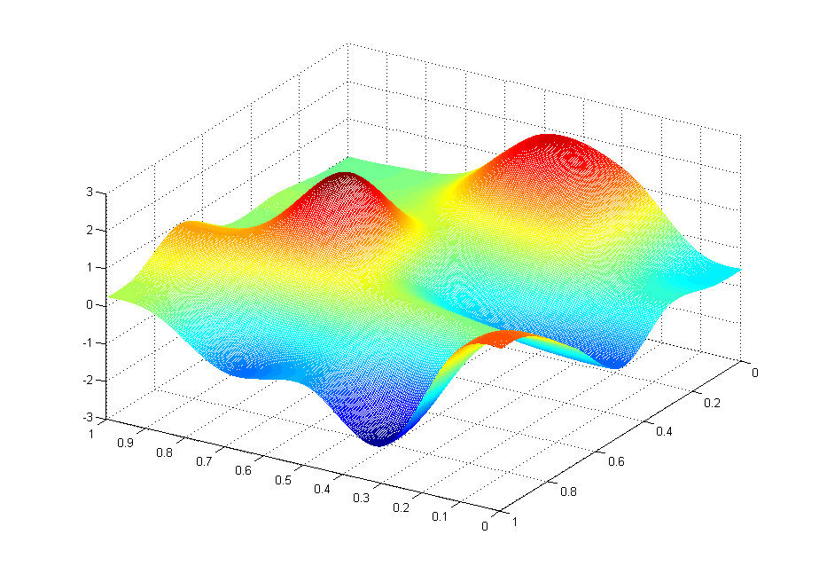{.is-center}

We will know that we have succeeded when our cost function is at the very bottom of the pits in our graph, i.e. when its value is the minimum.

The way we do this is by taking the **derivative** (the line tangent to a function) of our cost function. The slope of the tangent is the derivative at that point and it will give us a direction to move towards. We make steps down that derivative by the parameter <code>&alpha;</code>, called the **learning rate**, until we reach a local minima.

The gradient descent algorithm is:

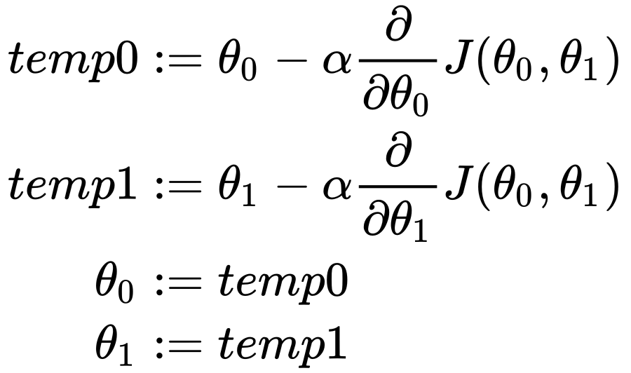{.is-center width=450}

Intuitively, this could be thought of as:

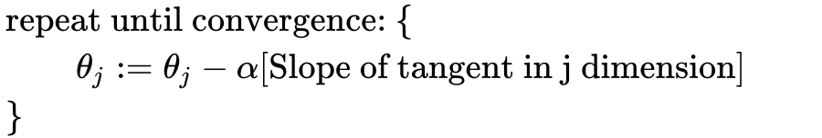{.is-center width=600}

## Gradient Descent for Linear Regression

When specifically applied to the case of linear regression, a new form of the gradient descent equation can be derived. We can substitute our actual cost function and our actual hypothesis function and modify the equation to (the derivation of the formulas can be found at end):

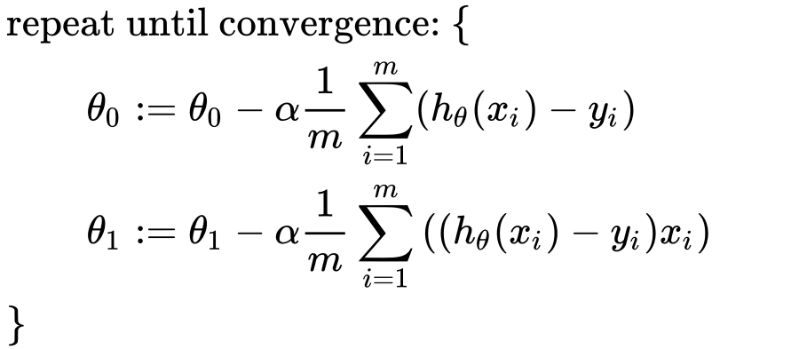{.is-center width=450}

where `m` is the size of the training set, <code>&theta;0</code> a constant that will be changing simultaneously with <code>&theta;1</code> and <code>xi</code>, <code>yi</code> are values of the given training set (data).

Note that we have separated out the two cases for <code>&theta;j</code> into separate equations for <code>&theta;0</code> and <code>&theta;1</code>; and that for <code>&theta;1</code> we are multiplying <code>xi</code> at the end due to the derivative.

The point of all this is that if we start with a guess for our hypothesis and then repeatedly apply these gradient descent equations, our hypothesis will become more and more accurate.

## Gradient Descent for Linear Regression: Intuition

Let us start with simple hypothesis <code>h&theta; = &theta;1 x</code>. (i.e <code>&theta;0 = 0</code>)

If we plot a graph between parameter <code>&theta;1</code> and cost function <code>J(&theta;1)</code>, it will look something like this.

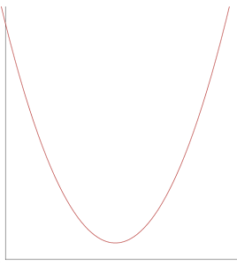{.is-center}

Suppose we start with <code>&theta;1</code> that has positive slope:

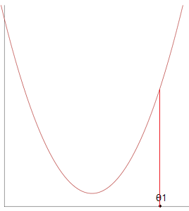{.is-center}

The <code>&theta;1</code> value will be updated as <code>&theta;1 := &theta;1 - &alpha; [\text{positive number}]</code>, thus <code>&theta;1</code> will decrease until it reaches local minima.

On the other hand, if we start with <code>&theta;1</code> with negative slope:

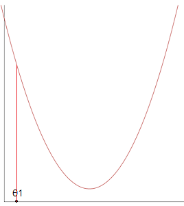{.is-center}

The <code>&theta;1</code> value will be updated as <code>&theta;1 := &theta;1 - &alpha; [\text{negative number}]</code>, thus <code>&theta;1</code> will increase until it reaches local minima.

If <code>&alpha;</code> is too small, gradient descent can be too slow, where as if it is too large, it can overshoot the minima. It may fail to converge, or even diverge.

Gradient descent can converge to a local minimum, even with the learning rate <code>&alpha;</code> fixed.

As we approach a local minimum, gradient descent will automatically take smaller steps. So, no need to decrease <code>&alpha;</code> over time.

The same can be extended to hypothesis: <code>h&theta; (x)= &theta;0 + &theta;1 x</code>. The plot for cost function in this case will be a surface plot:

{.is-center}

If we start from any arbitrary point on the graph and apply gradient descent (using slope at that point), we will reach a minima eventually.

## Frequently Asked Questions:

**Q: Why is the cost function about the sum of squares, rather than the sum of cubes?**

A: The sum of squares isn’t the only possible cost function, but it has many nice properties. Squaring the error means that an overestimate is "punished" just the same as an underestimate: an error of `-1` is treated just like `+1`, and the two equal but opposite errors can’t cancel each other. If we cube the error, we lose this property. Big errors are punished more than small ones, so an error of `2` becomes `4`.

The squaring function is smooth (can be differentiated) and yields linear forms after differentiation, which is nice for optimization. It also has the property of being “convex”. A convex cost function guarantees there will be a global minimum, so our algorithms will converge.

**Q: Why can’t I use 4th powers in the cost function? Don’t they have the nice properties of squares?**

A: Imagine that you are throwing darts at a dartboard, or firing arrows at a target. If you use the sum of squares as the error (where the center of the bulls-eye is the origin of the coordinate system), the error is the distance from the center. Now rotate the coordinates by 30 degree, or 45 degrees, or anything. The distance, and hence the error, remains unchanged. 4th powers lack this property, which is known as “rotational invariance”.

**Q: Why does 1/(2 \* m) make the math easier?**

A: When we differentiate the cost to calculate the gradient, we get a factor of 2 in the numerator, due to the exponent inside the sum. This '2' in the numerator cancels-out with the '2' in the denominator, saving us one math operation in the formula.

## Derivation of Gradient Descent Equations

We know that hypothesis is <code>h&theta; = &theta;0 + &theta;1 x</code>, and cost function is:

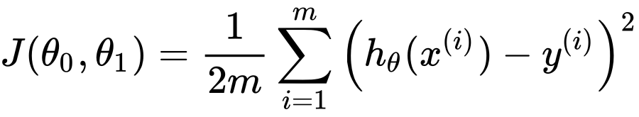{.is-center width=450}

Solving for derivatives:

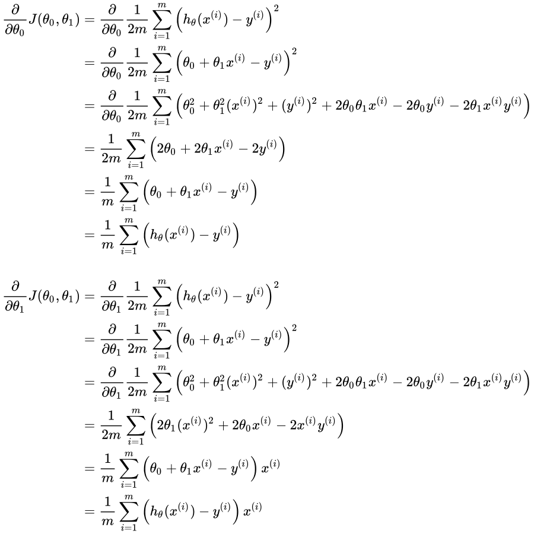{.is-center}

</Blog>
